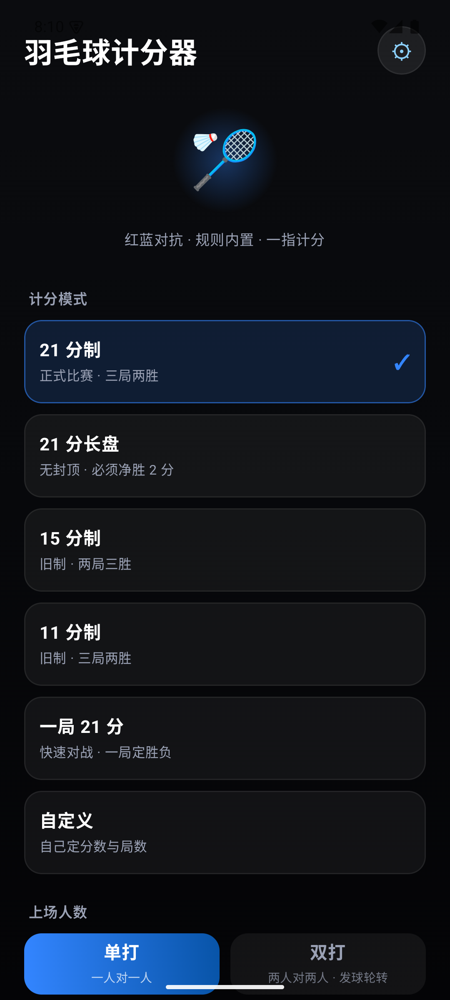
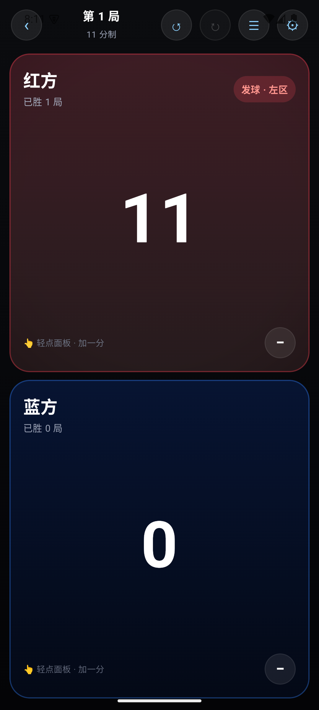
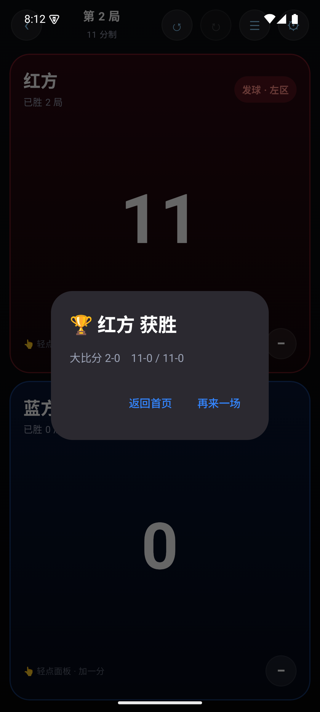

# 羽毛球计分器 · Android 版

一块屏幕上把比分记清楚。红蓝对抗、规则内置、一指计分。

Jetpack Compose · **不联网 · 不要账号 · 不收集任何数据**

| 首页 | 计分 | 胜出 |
| :---: | :---: | :---: |
|  |  |  |

## 下载安装

到 **[Releases](https://github.com/badminton-score/android/releases/latest)** 下载 `BadmintonScore-x.x-android.apk`，
直接装就行（已经签好名了）。

- **需要 Android 8.0（API 26）或更高**
- IPA / APK 用仓库里公开的密钥签名，密码写在 README 里 —— 这样所有人装到的是同一个签名的包，以后能直接覆盖升级
- 想确认来源可信请自己从源码编译，或对比 Release 里的 `sha256`

## 功能

和 [iOS 版](https://github.com/badminton-score/ios) 一致：

- **六种计分模式** —— 21 分制 / 21 分长盘 / 15 分制 / 11 分制 / 一局 21 分 / 自定义
- **自定义规则** —— 每局几分（5–50）、封顶（可关，或 目标+1..+20）、打几局（1/3/5）
- **单打 / 双打** —— 双打每方两人，发球按 BWF 规则轮转
- **一指计分** —— 整块面板都是按钮，点哪都加分
- **减分即撤回** —— 减分就是撤回上一次加分，撤销重做最多 200 步
- **到分自动判胜** —— 弹出胜出方
- **对战记录** —— 自动记录，支持选择批量删除和左滑删除
- **中途退出不怕丢** —— 比分实时存在本地，下次能「继续上一场」

## 构建

需要 **JDK 17+** 和 Android SDK（compileSdk 35）。

```bash
echo "sdk.dir=/path/to/android-sdk" > local.properties

./gradlew :app:assembleDebug      # 编译
./gradlew :app:testDebugUnitTest  # 跑测试
./Tools/make_apk.sh               # 打签好名的 Release APK
```

### 测试

**52 项单元测试**，和 iOS 版一一对应，覆盖：

- 单局胜负判定（含 20 平、29 平、封顶）
- 局点与赛点
- 每球得分制 / 发球得分制的发球权
- 自定义规则的参数与边界（夹取、无封顶、局数换算）
- 双打发球轮转
- 比赛会话、撤销重做、切换赛制、改队名
- 对战记录：自动记录、不重复记、没打完不记、各自局数、统计

领域模型和引擎是**纯 Kotlin、零 Android 依赖**，所以测试不用跑 Robolectric。

## 结构

```
app/src/main/java/com/badminton/score/
  MainActivity.kt         入口
  BadmintonApp.kt         Application，装配存储
  data/
    Scoring.kt            领域模型：双方、单双打、赛制、规则、比赛状态
    ScoreEngine.kt        纯函数计分引擎
    MatchStore.kt         会话状态：撤销重做、浮层、持久化
    MatchHistory.kt       对战记录
    Storage.kt            SharedPreferences 落盘
  ui/
    ScoreApp.kt           顶层状态切换（**没用 NavHost**，见下）
    Components.kt         玻璃卡片、按钮等
    screens/              首页 / 计分 / 设置 / 对战记录
    theme/                配色（和 iOS 的 Theme.swift 一致）
```

### 为什么顶层不用 Navigation Compose

iOS 版一开始用 `NavHost`，出过「返回栈被弹空 → 整屏空白」。
本 App 层级就这么浅（首页 / 计分 / 设置 / 记录），
直接用一个状态变量切换，**结构上就不可能空**。

## 许可证

[MIT](LICENSE)
